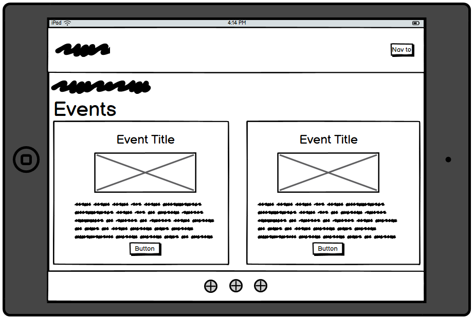
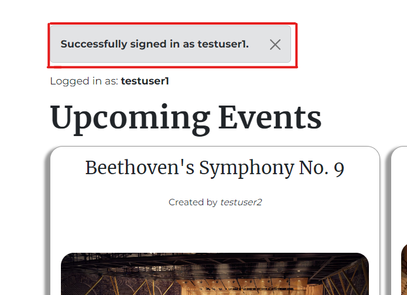
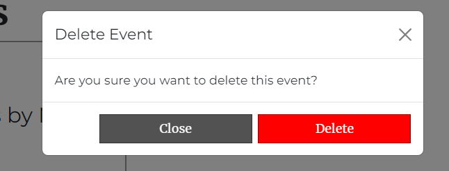

# [Musicality](https://musicality-event-booking-app-e0cfc73239f6.herokuapp.com/)

As a lover of classical music, I yearn to become immersed within a grand concert hall, basking in the warm glow of radiant oak and mahogany, and becoming washed away in an ocean rich with choral violins and cellos, transcendent piano scales, and triumphant brass crescendos. However, I have often found myself pained by jumbled heaps of vague concert information from other sites and, when I manage to find something which peaks my interest, it seldom satisfies precisely what I'm looking for.

## Introducing **Musicality.**

Musicality is a simple yet stunningly effective web application powered by HTML, CSS, Bootstrap, JavaScript, Python, Django, and ElephantSQL. It was designed with but one purpose: to forge and unite a community of classical music lovers around the world, where anyone with a passion for strings and flutes can find a concert event near them. Details of an event will be presented clearly, giving users all the information they need, such as:
- Who's performing the music
- Where the event will take place (both city and venue)
- When the event will take place (date and time)
- How much it will cost to attend (per person)

If the user so desires, they can view additional details about the event which will provide them with more information about what they may or may not be interested in attending. Allowing users to really see precisely what they're going for is the most efficent way to ensure that they are fully satisfied with the service.

But what if someone is visiting the site with the intention of creating an event which will then be displayed to other users?

They can accomplish that, too. ANY user has the ability to create an event of their choosing, filling in all the required details. Fortunately, Musicality is equipped with a thorough validation system to ensure that users can't create mock events, or events with erroneous information. All events which are created by users are put up for review by a site admin, who can then scour through each created event and ensure that it is accurate in terms of details, as well as established with correct details and clear information.

Who is Musicality *really* intended to be used by? The answer is very simple: ***anyone.***

Anyone who possesses a mouse and keyboard, a tablet, or a phone can use Musicality, because ultimately, ***anyone*** can an infatuation for music. Other sites may attempt to disregard those who are not of a high status, but Musicality is a community for all. For those who have trudged through sites which present messy, unclear information when they just want to simply book a classical music concert event: look no further. Musicality takes all the hassle away and displays precisely what you're looking for. Once a user has found an event which they would like to attend, they simply book the event, at which point they will be alerted that their event is booked and ready for them to attend.

Simple design, seamless navigation, and the aesthetic presentation of concise information. These are the qualities which Musicality strives to achieve.

## UX

### Design Thinking

The first thing I had in mind was a vision of something simple and clean, something which subtly blends colors without overloading the eyes; information was priority, and the presentation of such was paramount in my design thinking. Therefore, I opted to adhere to the following:

- Collapsible menu on all screen sizes. This ensured that:
  - The links were neatly contained
  - The navbar would not look untidy
  - Solid white against a dark blue background would alert users to the menu
- White backgrounds with dark text
- White text against dark colors
- A dark blue acting as the primary hue, giving the site a professional and formal feel
- Clearly presented forms for users to create/edit events and reviews and sign up/log in to the site

### Colour Scheme

- `#fafafa`: an off-white color used for primary text.
- `#010150`: a dark-blue color used for the nav, footer, and primary buttons.
- `#3838a0`: a lighter blue used for secondary buttons.
- `#525252`: A darkish grey used for tertiary buttons/elements.

I used [coolors.co](https://coolors.co/e84610-009fe3-4a4a4f-445261-d63649-e6ecf0-000000) to generate my colour palette:

### Typography

- I used [Montserrat](https://fonts.google.com/specimen/Montserrat) for the main body text of the website. I chose this font due to its professional appearance when displaying information.

- I used [Merriweather](https://fonts.google.com/specimen/Merriweather) for titles and navigation links, giving the site a more formal feel. Between this font and Montserrat, the site blended beautifully with a mix of informality and professionalism, reinforcing the fact that the site is for anyone and everyone.

- I used [Font Awesome](https://fontawesome.com) icons for the footer, allowing me to present links to social media platforms in a succinct manner.

## User Stories

- As a User (viewer/member) I can see upcoming events so that I can book an event within a short space of time.
- As a User (viewer) I can sign up as a member so that I can access the full features of the site.
- As a user (any role) I can see icons for the product's socials so that I can keep up to date with news through social media.
- As a user (any role) I can view a paginated list of events so that I can navigate through events and select which one to view/book.
- As a new site user, I would like to ____________, so that I can ____________.

### Returning Site Users

- As a Logged in user I can write a review for an event so that I can tell others about my experience.
- As a Logged in user I can edit or my review on an event so that I can amend my review with additional information/fix mistakes.
- As a Logged in user I can click on events and see more details so that I can see more information/reviews about the event and potentially book it.
- As a logged in user I can read reviews on events so that I can see if it's suitable for me.
- As a logged in user I can create an event so that I can list an upcoming event for other users to book.
- As a logged in user I can delete my own created event so that I can ensure that irrelevant events are not booked by others.
- As a logged in user I can edit an event that I created so that I can update information about the event if it changes.
- As a logged in user I can book an event so that I can attend an event which I'm interested in.

### Site Admin

- As a Site admin I can approve or reject events from creators so that I can ensure that only proper events are listed to members.
- As a Site admin I can approve reviews so that I can filter out objectionable reviews from users.

## Wireframes

Personally, I work best off low fidelity wireframes which help the overall vision to flourish. I kept my wireframes simple and used them as the foundation from which to build my final product. I wanted users to see a grid format of events when the page first loaded, initiating the first six events from the database:
- Three events per row on Desktop
- Two events per row on tablet
- One event per row on mobile

This manner of approach would ensure that users would receive precisely the information they came to the site for.

I used [Balsamiq](https://balsamiq.com/wireframes) to design my site wireframes.

### Mobile Wireframe

### Tablet Wireframe

### Desktop Wireframe

## Features

### Existing Features

- **Navbar**

  - The Navbar contains a navigation menu with the following links for unregistered users:
    - Home
    - About
    - All Events
    - Register
    - Log in
  - Additional links visible to logged in USERS:
    - My Pending Events
    - My Pending Reviews
    - My Booked Events
    - Create Event
    - Logout
  - Links visible to admin:
    - "Admin Panel" which extends to reveal:
      - Approve Events
      - Approve Reviews

  *Collapsed Navbar*
  

  *Expanded Navbar - Viewer*
  

  *Expanded Navbar - Logged in user*
  

  *Expanded Navbar - Admin*
  

- **Registration**
  - Registration and log in functionality was implemented with the use of the django-allauth package. The sign up and log in forms were styled with crispy forms and crispy bootstrap.
  - On visiting the site, a message will be displayed at the top of the page alerting users that they are not currently logged in.
    
  - After clicking the "Register" link from the navigation menu, users will be directed to a user registration form.
    
  - Registration is vital for users who wish to book/create events, as well as seeing the full details of an event and leaving reviews.

- **Logging In**
  - Users can log in with their credentials once they have registered.
    - 
  - Once logged in, users will be alerted with a success message:
    - 

- **Logging Out**
  - When a user clicks "Logout" from the navigation menu, they will be navigated to a page confirming that they want to log out.
    - 
  - Once logged out, they will be alerted that they have been signed out.
    - 

- **Creating Events**
  - A logged in user can create an event by clicking the "Create Event" link in the navigation menu. They will be taken to a form.
    - 
    - 
  - Once the user clicks the "Create Event" button, the event will go up for approval by an admin, and the user will be alerted:
    - 

- **Pending Events**
  - Once a user has created an event, they will be able to see it (as well as any other events which require approval) in "My Pending Events"; a page accessible from the navigation menu.
    - 
  - Users can delete events from this list if they feel they are no longer necessary, therefore no longer requiring approval by an admin.
    - 
    - 
    - 

- **Approving Events (Admin)**
  - Building on the previous feature, an admin can either approve or reject an event which was created by a user. They can access a page of pending events from the admin panel in the navigation menu.
    - 
  - If approved, the admin is alerted that the event was approved. The event will now be displayed amongst the rest of the events. The position in which it appears on the home page/all events page depends on the date on which the event takes place.
    - 
  - If rejected, the admin is alerted that the event was rejected and deleted. The event will no longer exist in the database. Providing there are no more events pending approval, the page will inform the admin that there are no pending events for approval.
    - 