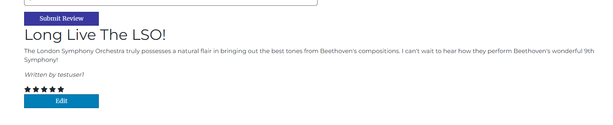
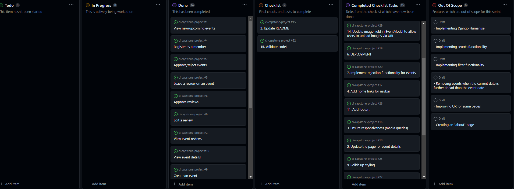

# [Musicality](https://musicality-event-booking-app-e0cfc73239f6.herokuapp.com/)

As a lover of classical music, I yearn to become immersed within a grand concert hall, basking in the warm glow of radiant oak and mahogany, and becoming washed away in an ocean rich with choral violins and cellos, transcendent piano scales, and triumphant brass crescendos. However, I have often found myself pained by jumbled heaps of vague concert information from other sites and, when I manage to find something which peaks my interest, it seldom satisfies precisely what I'm looking for.

## Introducing **Musicality.**

Musicality is a simple yet stunningly effective web application powered by HTML, CSS, Bootstrap, JavaScript, Python, Django, and ElephantSQL. It was designed with but one purpose: to forge and unite a community of classical music lovers around the world, where anyone with a passion for strings and flutes can find a concert event near them. Details of an event will be presented clearly, giving users all the information they need, such as:
- Who's performing the music
- Where the event will take place (both city and venue)
- When the event will take place (date and time)
- How much it will cost to attend (per person)

If the user so desires, they can view additional details about the event which will provide them with more information about what they may or may not be interested in attending. Allowing users to really see precisely what they're going for is the most efficent way to ensure that they are fully satisfied with the service.

But what if someone is visiting the site with the intention of creating an event which will then be displayed to other users?

They can accomplish that, too. ANY user has the ability to create an event of their choosing, filling in all the required details. Fortunately, Musicality is equipped with a thorough validation system to ensure that users can't create mock events, or events with erroneous information. All events which are created by users are put up for review by a site admin, who can then scour through each created event and ensure that it is accurate in terms of details, as well as established with correct details and clear information.

Who is Musicality *really* intended to be used by? The answer is very simple: ***anyone.***

Anyone who possesses a mouse and keyboard, a tablet, or a phone can use Musicality, because ultimately, ***anyone*** can an infatuation for music. Other sites may attempt to disregard those who are not of a high status, but Musicality is a community for all. For those who have trudged through sites which present messy, unclear information when they just want to simply book a classical music concert event: look no further. Musicality takes all the hassle away and displays precisely what you're looking for. Once a user has found an event which they would like to attend, they simply book the event, at which point they will be alerted that their event is booked and ready for them to attend.

Simple design, seamless navigation, and the aesthetic presentation of concise information. These are the qualities which Musicality strives to achieve.

## UX

### Design Thinking

The first thing I had in mind was a vision of something simple and clean, something which subtly blends colors without overloading the eyes; information was priority, and the presentation of such was paramount in my design thinking. Therefore, I opted to adhere to the following:

- Collapsible menu on all screen sizes. This ensured that:
  - The links were neatly contained
  - The navbar would not look untidy
  - Solid white against a dark blue background would alert users to the menu
- White backgrounds with dark text
- White text against dark colors
- A dark blue acting as the primary hue, giving the site a professional and formal feel
- Clearly presented forms for users to create/edit events and reviews and sign up/log in to the site

### Colour Scheme

- `#fafafa`: an off-white color used for primary text.
- `#010150`: a dark-blue color used for the nav, footer, and primary buttons.
- `#3838a0`: a lighter blue used for secondary buttons.
- `#525252`: A darkish grey used for tertiary buttons/elements.

I used [coolors.co](https://coolors.co/e84610-009fe3-4a4a4f-445261-d63649-e6ecf0-000000) to generate my colour palette:

### Typography

- I used [Montserrat](https://fonts.google.com/specimen/Montserrat) for the main body text of the website. I chose this font due to its professional appearance when displaying information.

- I used [Merriweather](https://fonts.google.com/specimen/Merriweather) for titles and navigation links, giving the site a more formal feel. Between this font and Montserrat, the site blended beautifully with a mix of informality and professionalism, reinforcing the fact that the site is for anyone and everyone.

- I used [Font Awesome](https://fontawesome.com) icons for the footer, allowing me to present links to social media platforms in a succinct manner.

## User Stories

- As a User (viewer/member) I can see upcoming events so that I can book an event within a short space of time.
- As a User (viewer) I can sign up as a member so that I can access the full features of the site.
- As a user (any role) I can see icons for the product's socials so that I can keep up to date with news through social media.
- As a user (any role) I can view a paginated list of events so that I can navigate through events and select which one to view/book.
- As a new site user, I would like to ____________, so that I can ____________.

### Returning Site Users

- As a Logged in user I can write a review for an event so that I can tell others about my experience.
- As a Logged in user I can edit or my review on an event so that I can amend my review with additional information/fix mistakes.
- As a Logged in user I can click on events and see more details so that I can see more information/reviews about the event and potentially book it.
- As a logged in user I can read reviews on events so that I can see if it's suitable for me.
- As a logged in user I can create an event so that I can list an upcoming event for other users to book.
- As a logged in user I can delete my own created event so that I can ensure that irrelevant events are not booked by others.
- As a logged in user I can edit an event that I created so that I can update information about the event if it changes.
- As a logged in user I can book an event so that I can attend an event which I'm interested in.

### Site Admin

- As a Site admin I can approve or reject events from creators so that I can ensure that only proper events are listed to members.
- As a Site admin I can approve reviews so that I can filter out objectionable reviews from users.

## Wireframes

Personally, I work best off low fidelity wireframes which help the overall vision to flourish. I kept my wireframes simple and used them as the foundation from which to build my final product. I wanted users to see a grid format of events when the page first loaded, initiating the first six events from the database:
- Three events per row on Desktop
- Two events per row on tablet
- One event per row on mobile

This manner of approach would ensure that users would receive precisely the information they came to the site for.

I used [Balsamiq](https://balsamiq.com/wireframes) to design my site wireframes.

### Mobile Wireframe

### Tablet Wireframe

### Desktop Wireframe

## Features

### Existing Features

- **Navbar**

  - The Navbar contains a navigation menu with the following links for unregistered users:
    - Home
    - About
    - All Events
    - Register
    - Log in
  - Additional links visible to logged in USERS:
    - My Pending Events
    - My Pending Reviews
    - My Booked Events
    - Create Event
    - Logout
  - Links visible to admin:
    - "Admin Panel" which extends to reveal:
      - Approve Events
      - Approve Reviews

  *Collapsed Navbar*
  

  *Expanded Navbar - Viewer*
  

  *Expanded Navbar - Logged in user*
  

  *Expanded Navbar - Admin*
  

- **Registration**

  - Registration and log in functionality was implemented with the use of the django-allauth package. The sign up and log in forms were styled with crispy forms and crispy bootstrap.
  - On visiting the site, a message will be displayed at the top of the page alerting users that they are not currently logged in.
    
  - After clicking the "Register" link from the navigation menu, users will be directed to a user registration form.
    
  - Registration is vital for users who wish to book/create events, as well as seeing the full details of an event and leaving reviews.

- **Logging In**

  - Users can log in with their credentials once they have registered.
    
  - Once logged in, users will be alerted with a success message:
    [!User login message](documentation/feature-user-login-message)

- **Logging Out**

  - When a user clicks "Logout" from the navigation menu, they will be navigated to a page confirming that they want to log out.
    
  - Once logged out, they will be alerted that they have been signed out:
    

- **Creating Events**

  - A logged in user can create an event by clicking the "Create Event" link in the navigation menu. They will be taken to a form.
    
    
  - Once the user clicks the "Create Event" button, the event will go up for approval by an admin, and the user will be alerted:
    

- **Pending Events**

  - Once a user has created an event, they will be able to see it (as well as any other events which require approval) in "My Pending Events"; a page accessible from the navigation menu.
    
  - Users can delete events from this list if they feel they are no longer necessary, therefore no longer requiring approval by an admin.
    
    
    

- **Approving/Rejecting Events (Admin)**

  - Building on the previous feature, an admin can either approve or reject an event which was created by a user. They can access a page of pending events from the admin panel in the navigation menu.

    - 

  - If approved, the admin is alerted that the event was approved. The event will now be displayed amongst the rest of the events. The position in which it appears on the home page/all events page depends on the date on which the event takes place.

    - 

  - If rejected, the admin is alerted that the event was rejected and deleted. The event will no longer exist in the database. Providing there are no more events pending approval, the page will inform the admin that there are no pending events for approval.
  
    - 

- **Editing Events**

  - Once a user has created an event and it becomes approved, they can also edit that event. Only the user who created the event is able to edit that event.

    - 

    - 

    - 

  - The event edit form is prepopulated with all the data which was inputted when creating the event. Once the user has made the changes and clicked "Save Changes", the event will be put back up for approval by an admin. This is to ensure that a user doesn't create an accurate event and then edits it with inaccurate, false, or offensive information which could become presented to other users.

    - 

    - 
    - *In this example, an exclamation mark was added to the title. Now, it's pending approval again.*

- **Deleting Events (Current User/Admin)**

  - As previously demonstrated, users are able to delete their pending events. However, users can also **delete** events which they created and have been approved.
    - 

    - 

    - 
  
  - Once the event has been confirmed to be deleted, the user will be alerted via a message that their event was successfully deleted. Now, the event will no longer appear on the home page or the "All Events" list.

- **Booking Events**
  - All users will be able to book an event after clicking on "View Full Event Details" on an event from the home page or "All Events" list. From here, users will be navigated to a page which expands on details for the event, including a description of the event, reviews for the event, and the ability to book the event.

    - 

  - Once the user clicks the button, they will be navigated to a page where they can select how many tickets they'd like to book. The minimum tickets they can purchase is 1, while the maximum is 10.

    - 
    
    - 

  - Once the user has booked an event, they will receive a message informing them that the event was booked with the number of tickets selected. In the view logic behind this, the word "ticket" will be displayed if 1 ticket is selected, and the word "tickets" will be displayed if more than 1 tickets are selected.

    - 

- **Viewing and deleting booked events**
  - Users will be able to see the events which they have booked by navigating to "My Booked Events" from the navigation menu.

    - 
  
  - From here, they can view their booked events which will display the title and number of tickets for that event.

  - They can also delete the event. As it stands, there is no confirmation in place, so the action is sudden and final. This is something to be addressed in a future sprint. However, once deleted, the user will be informed via a message that their booking has been deleted. Once this action has been taken - and providing the user has no further bookings - they will also be informed that they currently have no booked events, and that they may view the latest events should they wish to book one.

    - 

- **Creating Reviews**

  - Logged in users also have the ability to create and leave a review on selected events. They can access the form for writing a review from the expanded details page for the selected event. Users can only leave reviews providing they did not also create the selected event.

    - 
      - *Logged in as "testuser1" who did not create the event*

    - 
      - *Logged in as "testuser2", the creator of the event. Now, a message alerting the user that they cannot leave a review on their own event is displayed in place of the review form.*

  - Once the user has submitted the review, it will go up for approval by a site admin. They will be informed of this via a message, and it will also be displayed in "My Pending Reviews" which is accessible from the navigation menu.

    - 

    - 

- **Approving/Rejecting Reviews (Admin)**

  - Site admins can either approve or reject of a review which was submitted for approval. 
    - If a review is approved, then it will become displayed as a review on the event which the user submitted it on.
    - If a review is rejected, then it will be deleted from the database and therefore will not be displayed on the event which the user submitted it on.

  - In both instances, the site admin will be alerted of their actions via a message. Providing there are no more reviews up for approval, the text of the page will inform the admin that there are no pending reviews at the moment.

    - 

    - 

    - 

- **Viewing and Editing Reviews**

  - Once a review has been approved, it will be visible on the selected event by all logged-in users. If the user wrote the review, they will also have the option to edit it.

    - 

  - Once a user clicks to edit their review, they will be taken to an edit form where they can add/amend content for their review. Just as with the event edit form, the review edit form will be prepopulated with the content from the review which they originally created.

    - 

  - Once the review has been edited, it will go back up for review by an admin. Again, this is to ensure that users can't edit their previously approved reviews with anything irrelevant or offensive.

    - 

- **Grid Display**

  - A grid display was my priority. It ensured that everything would be displayed neatly and, with the help of media queries, responsively.

    - 

    - 

    - 

- **Footer**

  - A simple, responsive footer displaying social links and copyright text is presented in the footer.

    - 

### Future Features

- **About**
  
  - In the current build, the website does not contain an "About" section. As such, the "About" link from the navigation menu is effectively a "dead link" which leads to nowhere but the current page.
  
  - I had every intention of implementing an "about" Django app which would render the template and views to adhere with separation of concerns. However, due to time constraints, I focused on the CRUD functionality for creating, reading, updating, and deleting Events, Bookings, and Reviews.

- **Django Humanise**

  - Django Humanise is a package which makes elements such as dates, times, numbers, etc. more readable. However, it remained out of scope for the sprint.

- **Search Functionality**

  - I would have liked the searchbar to be functional and allow users to search by event location, venue, date, etc. but I did not have time to incorporate it in this version of the product.

- **Filter Functionality**

  - Ideally, users would have been able to filter events by location, price, etc. but this feature remained out of scope for this sprint. Both the search and filter functionalities would be high priority for a future sprint.

- **Removing Events Beyond Date**

  - I looked at ways for events to become automatically removed from the events grid when the date on which the event takes place surpasses the current date. However, I looked into this too late.
  
  - This would be a high-priority feature to implement in a future sprint.

- **Enhancing the UX/UI on User/Admin Pages**

  - Currently, some pages are lacking aesthetic styling, namely the presentation of reviews and the admin pending reviews list.

  - This feature would be addressed in a future sprint where the styles are polished and updated to match the rest of the site.

- **Improved Selection for Venues/Cities**

  - In the MVP, locations are currently limited to the UK. However, a user has the ability to input whatever location and venue they desire, even if they are fictitious. Although this may be more complicated, it would be ideal to connect to an API which would retrieve and present data to a user, allowing them to select a country, then a city which exists in that country, and then a venue which exists in that city.

  - Due to the layers of complex functionality behind this feature, it could not be implemented in this sprint.

- **Implementing Delete Confirmation Throughout**

  - As it stands, the "delete booking" button is not linked up to a delete confirmation modal. As such, in a future sprint, it would be paramount to ensure that all delete buttons trigger a confirmation modal and prevent the accidental deleting of user created elements.

- **Easier deleting of reviews**

  - Due to time constraints, I did not implement functionality for review authors and site admins to delete reviews with the click of a button. As such, site admins must navigate to the Django admin panel and manually delete the model.

  - A "delete" button and confirmation modal will be implemented in a future sprint, providing users and admins a simple method of deleting unnecessary reviews.

- **Reinstating Cloudinary Image Storage**

  - During development, I encountered issues where user uploaded images weren't being registered, and so a placeholder image would always be displayed. I researched the issue, but could not find any reasonable solution in time.
  - With time trickling away, I opted for a fallback where users could have their image displayed via an image URL. Whilst this is far from an ideal solution, it enabled user images to work on a level which I was satisfied with enough to proceed with development.
  - Reinstating the use of uploading images via a CloudinaryField would be high priority in a future sprint.

## Tools & Technologies Used

- [HTML](https://en.wikipedia.org/wiki/HTML) used for the main site content.
- [CSS](https://en.wikipedia.org/wiki/CSS) used for the main site design and layout.
- [CSS Flexbox](https://www.w3schools.com/css/css3_flexbox.asp) used for an enhanced responsive layout.
- [CSS Grid](https://www.w3schools.com/css/css_grid.asp) used for an enhanced responsive layout.
- [JavaScript](https://www.javascript.com) used for user interaction on the site.
- [Python](https://www.python.org) used as the back-end programming language.
- [Git](https://git-scm.com) used for version control. (`git add`, `git commit`, `git push`)
- [GitHub](https://github.com) used for secure online code storage.
- [Heroku](https://www.heroku.com) used for hosting the deployed site.
- [Gitpod](https://gitpod.io) used as a cloud-based IDE for development.
- [Bootstrap](https://getbootstrap.com) used as the front-end CSS framework for modern responsiveness and pre-built components.
- [Django](https://www.djangoproject.com) used as the Python framework for the site.
- [PostgreSQL](https://www.postgresql.org) used as the relational database management.
- [ElephantSQL](https://www.elephantsql.com) used as the Postgres database.

## Database Design

Entity Relationship Diagrams (ERD) help to visualize database architecture before creating models.
Understanding the relationships between different tables can save time later in the project.

I used [DrawSQL](https://drawsql.app/) to create my ERDs and link users between events, bookings, and reviews.

## Agile Development Process

### GitHub Projects

I used [GitHub Projects](https://github.com/doctypeKieran/ci-capstone-project/projects) to keep track of my issues relating to fixes, features, and user stories.

The project board was set up as a Kanban board, informing me which features were still to do, which features were in progress whilst being worked on, and which features met the definition of done.

I created three additional columns:
  - **Checklist**

    - Items in this list helped me keep track of things which needed doing, such as:
      - Acceptance Criteria from User Stories still to be met
      - Bugs to resolve
      - Tasks to complete for full and final production

  - **Completed Checklist Tasks**
    
    - Once an item from the "Checklist" column was completed, it was moved to this column. This way, I could keep track of items which still needed to be addressed, and which ones were completed.

  - **Out Of Scope**
    
    - Any features which weren't able to be implemented in this sprint were placed in the "Out Of Scope" column. When I thought of a feature which had been referenced during development, but did not make it in the MVP, I placed it in the "Out Of Scope" column.

### GitHub Issues

I used [GitHub Issues](https://github.com/doctypeKieran/ci-capstone-project/issues) to keep track of issues and related them to my User Stories and Checklist items.

I created a User Story Template which acted as the skeleton for creating new user stories. Each user story would follow the convention:

***As a (role) I can (capability) so that (received_benefit)***

  > AC 1
  > AC 2
  > AC 3

Here, **AC** means "Acceptance Criteria" which would need to be met in order for the User Story issue to be marked as **Done**.

By following the procession of User Stories, it greatly helped me keep track of current progress and things left to do, thus allowing me to iterate through milestones effectively.

## Testing

For all testing, please refer to the [TESTING.md](TESTING.md) file.

## Deployment

The live deployed application can be found deployed on [Heroku](https://musicality-event-booking-app-e0cfc73239f6.herokuapp.com).

### ElephantSQL Database

This project uses [ElephantSQL](https://www.elephantsql.com) for the PostgreSQL Database.

I created an instance using ElephantSQL which I then linked to my Django project. I used the ElephantSQL database to store incoming data from new users, newly created events, newly booked events, and new reviews on events.

### Heroku Deployment

This project uses [Heroku](https://www.heroku.com), a platform as a service (PaaS) that enables developers to build, run, and operate applications entirely in the cloud.

To deploy on Heroku, I proceeded to do the following:

1. Created a new app on Heroku
2. Created a unique name for the app
3. Selected the region for the app
4. Selected "Create App"

In my workspace:

1. Installed gunicorn
2. `pip3 freeze --local > requirements.txt`
3. Created a Procfile
4. Added a line of code for Heroku deployment: `web: gunicorn musicality.wsgi`

Then back to Heroku:

1. Clicked on the "Settings" tab
2. Clicked to "Reveal config vars"
3. Set the following environmental variables:
  - `CLOUDINARY_URL`
  - `DATABASE_URL`
  - `SECRET_KEY`
  - *These variables were also stored in a file, `env.py`, which is ignored by the git version control by being placed in the `.gitignore` file*

4. Connected the app to GitHub
  - Went to the "Deploy" tab
  - Selected "GitHub" as the deployment method
  - Provided the URL to my GitHub repository
  - Ensured that the "main" branch was where the app was being deployed from
  - Clicked "Deploy Branch"
  - Opened the app to ensure it was successfully deployed