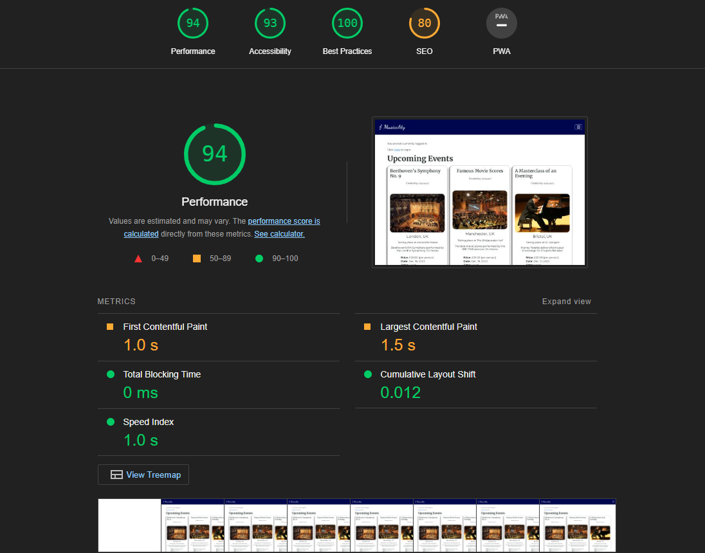

# Testing

Click [Here](README.md) to return back to the README.

## Validation

### HTML5 Validation

I used [W3C Markup Validation](https://validator.w3.org/) to validate my HTML5 code from all templates used in the project.

I used "validate by direct input" to place my HTML code from each template, one at a time, ensuring that the code meets all HTML and ARIA requirements.

The only elements which failed were either Bootstrap or DTL related.

### CSS Validation

I used [W3c CSS Validation](https://jigsaw.w3.org/css-validator/) to validate the CSS code from my custom stylesheet.

I used "validate by direct input" to place my CSS code from my custom stylesheet.

There were no errors in the code to resolve, and everything passed first time. This ensured me that I had not left any errors in my CSS code, nor had I left any selectors blank.

### JavaScript Validation

I used [JSLint](https://www.jslint.com/) to validate my JS code.

On running it through for the first time, most of my errors pertained to my use of single quotes over double quotes. I made the changes and the only two issues remaining were:

  - One line exceeded 80 characters. This was difficult to resolve, because the line was a ternary expression. Trying to break it up resulted in more errors from the linter: "Unexpected trailing space". I opted to keep the ternary expression on one line.
  - An error: `[JSLint was unable to finish] Unexpected 'let'. Unexpected 'for'.` appeared for line 4 of my `static/js/script.js`. Regrettably, I'm unsure why this issue was raised, nor do I know how to resolve it. It seems perfectly fine to me, but further research and knowledge is needed here so I can ensure my JS code meets standards in the future.

### Python Validation

I used [CI Python Linter](https://pep8ci.herokuapp.com/) to validate the Python code from every file, ensuring that they all met PEP8 coding standards.

I only validated the files which I wrote my own code in. The rest of the code was part of the Django installation package.

From the `events` app:

| File | Grade |
| ---- | ----- |
| `admin.py` | Pass |
| `forms.py` | Pass |
| `models.py` | Pass |
| `urls.py` | Pass |
| `views.py` | Pass |

From the `musicality` project directory:

| File | Grade |
| -----| ------|
| `urls.py` | Pass |

Running my app code through the CI Python Linter raised issues regarding with whitespace and lines which exceeded 79 characters. However, these have now been resolved and marked as "All clear, no errors found".

### Site Testing

#### Feature Testing

Screenshots of the site functionality being demonstrated can be found in the [README](README.md) under the **Features** section. However, here is a table of links and features I tested and the results which were met:

***LINKS***

| Link | Expected Outcome | Grade |
| ------- | ---------------- | ----- |
| Logo | Navigates to the home page when clicked | Pass |
| Home | Navigates to the home page when clicked | Pass |
| About | Navigates to an about page when clicked | Fail |
| All Events | Navigates to a paginated list of events when clicked | Pass |
| Register | Navigates to a registration form when clicked | Pass |
| Log in | Navigates to a screen where users can log in when clicked | Pass |
| My Pending Events | Navigates to a page with pending events when clicked | Pass |
| My Pending Reviews | Navigates to a page with pending reviews when clicked | Pass |
| My Booked Events | Navigates to a page with booked events when clicked | Pass |
| Create Event | Navigates to a page with a form to create an event | Pass |
| Admin panel | Admin panel opens a dropdown of links for admins | Pass |
| Approve Events | Navigates to a page to approve or reject created events | Pass |
| Approve Reviews | Navigates to a page to approve or reject submitted reviews | Pass |
| Logout | Navigates to a page confirming for the user to log out | Pass |

***FEATURES***

| Feature | Expected Outcome | Grade |
| ------- | ---------------- | ----- |
| Messages | A message will appear informing the user of a successful action | Pass |
| User logged in | Text displays the user logged in with their username | Pass |
| See events | Users and viewers can see events which have been created | Pass
| Create event | Creating an event will put it up for submission | Pass |
| Created events unapproved | By default, created events will have an approved value of "False" | Pass |
| See pending events | Admin can see a list of events pending approval | Pass |
| Approve pending events | Admin can approve pending events | Pass |
| Reject pending events | Admin can reject pending events | Pass |
| Approved events appear in list | Once approved, the event will show on home page and all events page | Pass |
| Rejected events get deleted | Once rejected, an event will be deleted from the DB | Pass |
| Edit an event | A user can edit the details on their event. It will go back up for submission | Pass |
| Delete an event | A user who created the event OR an admin can delete an event. It will then be deleted from the DB | Pass |
| See reviews | Users can see reviews written by other users on an event | Pass |
| Create review | Users can create a review on an event, but not on an event they created | Pass |
| Edit a review | Users can edit their own review. It will then be put back up for submission. | Pass |
| See pending reviews | Admin can see a list of reviews pending approval | Pass |
| Approve review | Admin can approve a review. It will then get displayed in the reviews for that event | Pass |
| Reject review | Admin can reject a review. It will then get deleted from the DB and not display. | Pass |
| Registration | New users can access a registration form from the "Register" link | Pass |
| Log in | Users can log in using a form after clicking "Log in" | Pass |
| Log out | Users get logged out after clicking "Log out" | Pass |
| Grid display | A CSS grid will display the events in a clear, responsive format | Pass |
| Functional buttons | Edit, delete, create buttons will be functional throughout the site | Pass |
| Footer | A footer displays social information and copyright details | Pass |
| Social links work | The social links will navigate to a new page when they're clicked. They will open in a new tab | Pass |

#### Responsiveness Testing

I ensured that the site would be fully responsive across multiple screen sizes. These were the sizes I ensured for responsiveness testing:

- X-Large screens (2500px+)
- Large screens (1440px)
- Laptop screens (1024px)
- Tablet screens (768px - 820px)
- Mobile screens (300px - 420px)

The site is fully tested and operational on the following browsers:

- Google Chrome
- Mozilla Firefox
- Opera

#### Lighthouse Testing

I used the [Lighthouse](https://chrome.google.com/webstore/detail/lighthouse/blipmdconlkpinefehnmjammfjpmpbjk) Chrome extension to measure the performance of my deployed site. Upon auditing the site, it came back with the following:

| Test | Value |
| ---- | ----- |
| Performance | 94 |
| Accessibility | 93 |
| Best Practices | 100 |
| SEO | 80 |

### Conclusion

The biggest takeaway from the testing was the non-functionality of the "About" link in the navigation menu. This was addressed in the "Future Features" section in the README. I have marked it as "Fail" to remind me of two things:

- That not all features can make it in one sprint
- That the feature is able to be implemented in a future sprint

With another couple of days, I would have gotten this feature implemented. However, I regarded the "about" section as being less important than implementing CRUD functionality, authentication, and authorization, as well as the clear presentation of data to users. I believe the latter acts as a sort of "about" in it's own regard, therefore I think of the "about" section as an 'expanded information' section which would arrive in the near future.

Click [Here](README.md) to return back to the README.